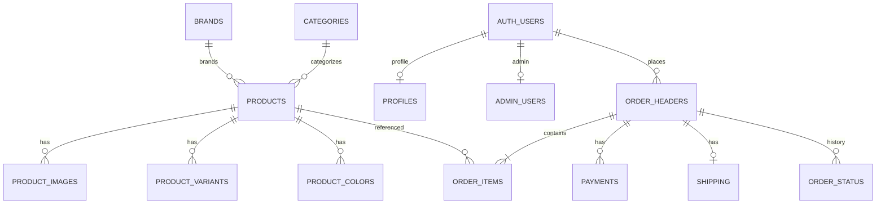

# AKM Care — Database Schema & Storage

> Authoritative source: `supabase/migrations/*.sql` (in chronological order).  
> `schema.sql` is a snapshot; prefer migrations.

---

## 1. Migration Timeline

| Migration | Purpose |
|-----------|---------|
| `20260421120000_baseline_schema.sql` | Services, products, legacy orders, stock_movements, cart, forms |
| `20260613120000_vendor_applications.sql` | Vendor apply + private documents bucket |
| `20260724045556_ecommerce_catalog_extension.sql` | Product ecommerce columns, wishlists, checkout_drafts |
| `20260724045557_catalog_normalized_backend.sql` | Brands/categories, images/variants/colors, inventory, merchandising, `catalog_product_list` |
| `20260724110000_shopping_workflow.sql` | Profiles, addresses, order_headers stack, generate_order_number |
| `20260724120000_admin_portal.sql` | admin_users, CMS, coupons, admin RLS, media bucket |
| `20260724124500_admin_function_grants.sql` | GRANT execute on admin helper functions |
| `20260724140000_critical_checkout_security.sql` | Lock order/cart/payment writes; access_token; get_order_receipt |

Seeds (manual): `seed_catalog.sql` (5 products), `seed_admin.sql`.

---

## 2. Entity Relationship (commerce core)

```text
auth.users ─┬─ profiles
            ├─ addresses
            ├─ admin_users
            ├─ cart_items / wishlists
            └─ order_headers ─┬─ order_items → products
                              ├─ payments
                              ├─ shipping
                              └─ order_status

products ─┬─ product_images
          ├─ product_variants
          ├─ product_colors
          ├─ inventory
          ├─ featured_products / related_products
          └─ brands / categories / subcategories

orders (legacy) ← written on payment verify; links order_header_id
stock_movements ← verify path
```

---

## 3. Table Catalog

### 3.1 Catalog

| Table | Purpose | Key columns | RLS (final) |
|-------|---------|-------------|-------------|
| `products` | Sellable items | slug, sku, prices, stock_quantity, status, gst, hsn, image_url, images jsonb | Public SELECT; admin ALL |
| `brands` | Brand master | name, slug, logo_url | Public read active; admin ALL |
| `categories` | Categories | name, slug, parent_id | Public read active; admin ALL |
| `subcategories` | Subcats | category_id, slug | Public read active; admin ALL |
| `product_images` | Gallery | url, sort_order, is_primary, storage_path | Public SELECT; admin ALL |
| `product_variants` | Variants | name, stock | Public read active; admin ALL |
| `product_colors` | Colours | hex, image_indexes | Public read active; admin ALL |
| `inventory` | Warehouse qty | quantity_on_hand, reserved | Public SELECT; admin ALL (**not updated on sale**) |
| `featured_products` | Merch slots | slot, display_order | Public read active; admin ALL |
| `related_products` | Related | relation_type | Public SELECT; **admin write policy missing in migrations** |
| `product_reviews` | Reviews stub | rating, is_approved | SELECT approved; **no insert policy** |

### 3.2 Commerce

| Table | Purpose | Key columns | RLS (final) |
|-------|---------|-------------|-------------|
| `order_headers` | Canonical order | order_number, access_token, razorpay_order_id, pricing_snapshot, totals, status, payment_status, customer_* | SELECT own user_id; admin ALL; **no client insert** |
| `order_items` | Lines | unit_price, quantity, line_total | SELECT via own header; admin ALL |
| `payments` | Payment records | razorpay_*, amount, status | SELECT own; admin SELECT; no client insert |
| `shipping` | Shipment | method, tracking, status | SELECT own; admin ALL |
| `order_status` | History | status, note | SELECT own; admin ALL |
| `orders` | Legacy paid lines | razorpay_*, order_header_id | Admin only; service role inserts on verify |
| `stock_movements` | Stock audit | quantity_change, previous/new | Admin SELECT; service role insert |
| `cart_items` | Server cart | user_id, quantity, snapshot | Auth user only |
| `wishlists` | Saved products | user_id, product_id | Auth user only |
| `checkout_drafts` | Draft JSON | session_id, payload | Public insert remains (**unused by Razorpay flow**) |
| `coupons` | Discounts | code, discount_type/value, limits | Public read active; admin ALL |
| `addresses` | Address book | pincode, city, is_default | Own CRUD |
| `profiles` | User profile | full_name, email, is_blocked | Own + admin |
| `saved_payments` / `returns` | Stubs | — | Own ALL |

### 3.3 Content / inbox / vendors / admin

| Table | Purpose | RLS |
|-------|---------|-----|
| `services`, `faq`, `motivation_quotes` | Site content | Public read active; admin ALL |
| `contact_submissions`, `feedback_submissions`, `product_interests`, `career_applications` | Forms | Public INSERT; admin ALL |
| `vendor_applications` | Vendor apply | Public INSERT; **admin SELECT not in migrations** |
| `vendors` | Approved vendors | RLS on, **no policies** → locked |
| `admin_users` | RBAC | Self SELECT / super_admin manage |
| `banners`, `cms_pages`, `site_settings`, `media_assets` | CMS | Public read (as applicable); admin ALL |

---

## 4. Views

### `catalog_product_list`

- Defined in `20260724045557` with `security_invoker = true`
- Joins product + brand/category/subcategory
- Aggregates `images`, `variants`, `colors` as JSONB
- `effective_price = coalesce(akm_care_price, selling_price, price)`
- Primary read model for shop (`productService`)

---

## 5. Functions & Triggers

| Object | Role |
|--------|------|
| `products_search_vector_update` | Trigger: search_vector + updated_at |
| `handle_new_user` | On auth.users insert → profiles |
| `addresses_single_default` | One default address |
| `generate_order_number` | SQL helper (Edge uses JS equivalent today) |
| `is_admin_user()` | SECURITY DEFINER admin check |
| `admin_has_role(text[])` | Role-scoped admin check |
| `get_order_receipt(text, uuid)` | SECURITY DEFINER receipt by order_number + access_token |

---

## 6. Indexes (notable)

- Products: slug, price, search_vector (GIN)
- order_headers: user_id+created_at, email, razorpay_order_id (unique partial), access_token+order_number
- product_images: (product_id, sort_order), primary flag
- payments: unique razorpay_payment_id when set
- coupons: code

---

## 7. Storage Buckets

| Bucket | Public | Typical path | Policies |
|--------|--------|--------------|----------|
| `products` | Yes | `{slug}/image-0N.webp` | Public SELECT; authenticated upload (legacy) **and** admin upload |
| `brands` | Yes | logos | Same pattern |
| `categories` | Yes | images | Same |
| `banners` | Yes | banners | Same |
| `thumbnails` | Yes | thumbs | Same |
| `media` | Yes | CMS media | Public SELECT; admin write |
| `vendor-documents` | **No** | application docs | Public INSERT only |

---

## 8. Seed Catalog Products

| Serial | Name | Slug | ID suffix |
|--------|------|------|-----------|
| 1 | AKMC SANI - 1007 | akmc-sani-1007 | …0001 |
| 2 | AKMC ROOH - 0002 | akmc-rooh-0002 | …0002 |
| 3 | AKMC DPB - LTA | akmc-dpb-lta | …0003 |
| 4 | AKMC MTE - MMLE | akmc-mte-mmle | …0004 |
| 5 | AKM RFX - MCMD | akm-rfx-mcmd | …0005 |

Coupon seed: `AKMCARE10` (10% percentage) from critical migration.

---

## 9. Database Diagram (Mermaid)



---

## 10. Related Documents

- [SYSTEM_ARCHITECTURE.md](./SYSTEM_ARCHITECTURE.md)
- [SHOP_WORKFLOW.md](./SHOP_WORKFLOW.md)
- [ADMIN_WORKFLOW.md](./ADMIN_WORKFLOW.md)
- [SECURITY_AUDIT.md](./SECURITY_AUDIT.md)
- [DEPLOYMENT_GUIDE.md](./DEPLOYMENT_GUIDE.md)
